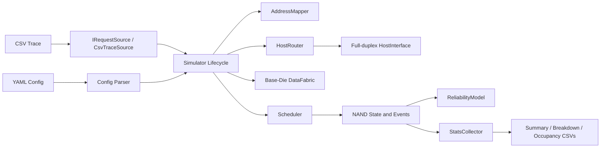
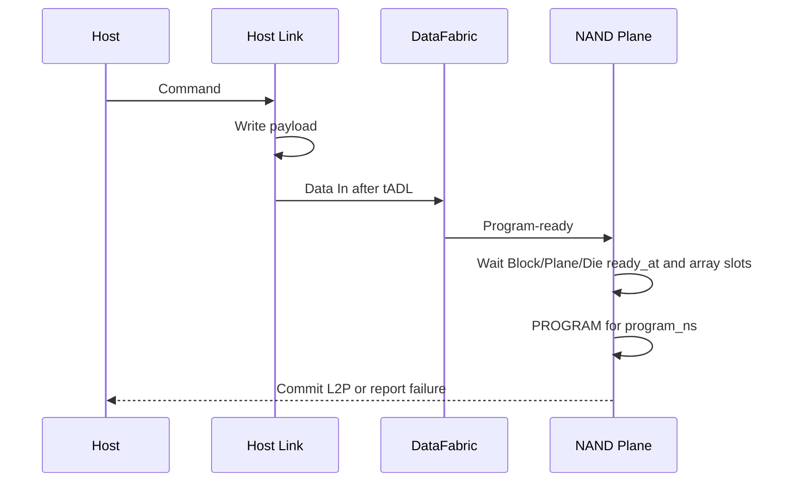
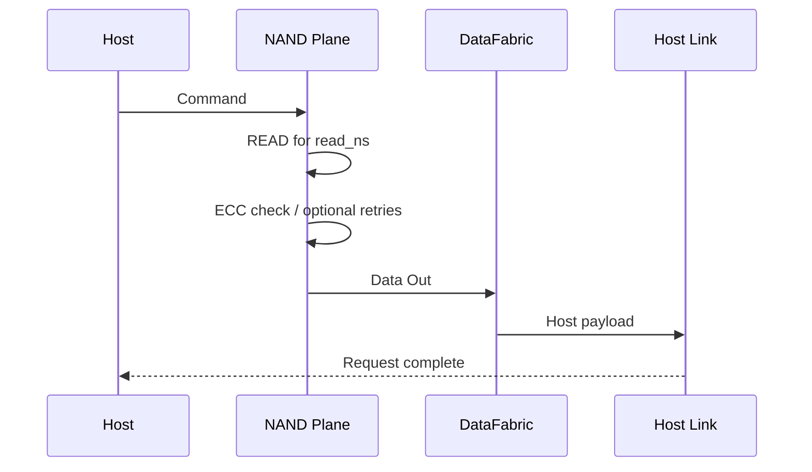

# HBFSim v0.1.1 架构设计

## 1. 目标与范围

HBFSim 用于回答以下问题：

- HBF Stack、Die、Plane 并行度如何影响延迟和吞吐；
- Host Interface 与 Base-Die Fabric 何时成为瓶颈；
- 映射、读优先调度、写饥饿保护如何改变尾延迟；
- Program/Erase、Suspend/Resume、Multi-plane、Cache Program 如何竞争资源；
- Program failure、RBER、ECC 和 Read Retry 如何影响失败率与 goodput。

它不模拟 NAND 单元电压分布、逐周期总线信号、ECC 编解码电路或 UCIe packet/flit。配置中的纳秒延迟是命令级抽象参数。

## 2. 总体结构



仿真是单线程确定性执行：所有动作最终转换为带时间戳的 `Event`，进入最小时间优先队列。相同时间戳使用递增的 `seq` 保持稳定顺序。

## 3. 源码模块

| 文件 | 职责 |
|---|---|
| `src/config.cpp` | YAML 子集解析、单位解析和配置合法性校验 |
| `src/trace.cpp` | `IRequestSource` 流式接口、CSV 逐条读取和时间戳校验 |
| `src/event_queue.cpp` | 确定性事件优先队列 |
| `src/mapper.cpp` | LPN 到 PPA 的映射、Host-managed frontier 和 L2P 提交 |
| `src/link.cpp` | 独立 Host 路由、全双工 HostInterface、显式端口/总带宽 DataFabric |
| `src/reliability.cpp` | Program failure、Poisson 位错误、ECC 与 Retry 抽样 |
| `src/scheduler.cpp` | Plane 队列、ready 判定、读优先、防饥饿、Multi-plane、Cache、Suspend/Resume |
| `src/events.cpp` | 完成事件、Page/Block 状态迁移、失败处理与统计更新 |
| `src/simulator.cpp` | 对象构造、请求拆分、资源连接、事件循环和状态查询 |
| `src/stats.cpp` | 固定内存分位数、延迟分解、队列时序和资源占用输出 |

公共数据结构和接口集中在 `include/hbfsim/core.h`。

## 4. 设备与资源层次

```text
Device
└── Stack [stacks]
    ├── Host Channel [host_channels_per_stack]
    ├── Base-Die DataFabric
    │   └── Data Port [ports_per_stack]
    └── Die [dies_per_stack]
        └── Plane [planes_per_die]
            └── Block [blocks_per_plane]
                └── Page [pages_per_block]
```

PPA 包含 `stack/die/plane/block/page/offset/data_port`；独立的 `HostRoute` 包含 `stack/channel`。Host Channel 按逻辑页条带选择，不再由 `data_port` 取模推导。Plane 被展平为全局索引，用于状态数组和利用率统计。

每个层次承担不同约束：

- Host Channel：可配置共享半双工，或拆分 Command/H2D/D2H 三个方向；
- DataFabric：Stack 内部总带宽与端口占用；
- Stack/Die：活跃 Plane 数量上限；
- Plane：队列、数据寄存器、当前阵列操作和挂起操作；
- Block：生命周期、Program frontier、有效/失效/失败位图和 ready 时间。

## 5. 请求与事件模型

Host 请求先转成 `Request`，再按 Page 边界拆成 `SubRequest`。`FlashTransaction` 是该结构的显式语义别名。Erase 和 Refresh 生成一个维护事务；Read/Write 可生成多个 Page 事务。

主要事件如下：

```text
DispatchWake
HostArrival → HostCommandDone → SubreqReady
NandDataInDone → NandProgramDone
NandReadDone → NandDataOutDone → SubreqDone
NandSuspendDone
NandEraseDone / NandRefreshDone
```

### 5.1 Write 路径



Host-managed 写入在真正开始 Program 时分配物理页，成功完成后才提交 L2P。覆盖写成功后旧 PPA 转为 `INVALID`；失败写消耗顺序编程位置，但旧 L2P 保持不变。

### 5.2 Read 路径



Read 阵列阶段结束后释放 Die/Stack active-plane slot，但 Plane 的数据寄存器保持占用，直到 Data Out 完成。Host payload 返回可继续在 Host Link 上流水化。

## 6. 调度架构

每个 Plane 有独立的 Read、Write、Erase、Refresh 队列。

基本策略：

1. 默认优先 Read；
2. 非 Read 请求等待超过 `write_starvation_ns` 后获得优先权；
3. 连续读取达到 `max_consecutive_reads` 后选择最老的非 Read 请求；
4. Stack 内通过 round-robin cursor 扫描 Plane，避免固定从 Plane 0 开始；
5. 操作还必须满足 Die 和 Stack 的 active-plane 上限。

命令最早发射时间为：

```text
max(
  subrequest.ready_time,
  plane.ready_at,
  block.ready_at,
  die.ready_at,
  die.command_ready_at
)
```

若当前时间尚未达到该值，调度器生成 `DispatchWake`，届时重新仲裁，而不是忙等。

## 7. 高级命令

### 7.1 Suspend/Resume

启用后，正在执行的 Program 或 Erase 可以为同 Plane 的排队 Read 让路：

```text
Program/Erase active
→ Suspend command
→ suspend_ns
→ release array slot
→ serve reads
→ resume_ns
→ continue remaining array time
```

旧完成事件通过 `array_completion_time` 校验自动失效。为避免没有收益的切换，剩余时间必须大于 suspend 与 resume 开销之和。Cache Data In 占用数据寄存器时不会开始 Suspend。

### 7.2 Multi-plane

同一 Die 上，操作类型、Block index 和 Page index 相同、Plane 不同的请求可以组成一个 batch。`multi_plane_setup_ns` 是收集窗口，batch 共享一次 Die command interval，但每个 Plane 仍独立占用 array slot。

### 7.3 Cache Program

每个 Plane 最多暂存一个后继 Write。后继页的 Data In 可以和当前 Program 阵列阶段重叠；当前 Program 完成后再开始缓存页的 Program。Cache admission 仍服从统一队列顺序，不能越过更早的 Erase 或 Refresh。

## 8. 确定性与内存策略

- 相同 trace、配置和 `random_seed` 应产生相同结果；
- 稳定 Page 状态使用按需分配的位图；
- `READING/PROGRAMMING` 只保存在全局稀疏瞬态表中；
- 已完成 Request/SubRequest 会从活动表删除；
- `CsvTraceSource` 仅保留下一条记录，事件队列只包含到达或在途事件；
- 延迟分位数使用固定大小对数直方图，不保存全部延迟样本；
- 该设计避免为完整设备容量创建重量级 Page 对象。

生产执行路径按 `INITIALIZE → WARMUP → MEASURE → DRAIN` 推进。Warmup 请求完成后才读取 Measurement 的第一条 trace；若原始时间戳早于 Warmup 完成时间，Measurement 整体平移，保持请求间隔不变。

## 9. 扩展接口

建议后续按以下边界扩展：

- GC/FTL：在 Mapper 之上增加 block allocator、victim selector 和内部搬移请求；
- Wear leveling：使用 `erase_count` 驱动 block 选择；
- Retention/Read disturb：在 ReliabilityModel 中根据时间和读次数动态计算 RBER；
- Thermal：根据 Stack 功耗状态动态缩放时序；
- Protocol：在 Host Link 外增加 packet/flit 与 credit 模型；
- 并行事件：保持事件语义不变，再按 Stack 分区并行化。

## 10. 当前边界

- Multi-plane 是兼容命令级合并，不模拟厂商专有命令序列；
- Cache Program 为单页缓存，不模拟任意深度流水；
- ECC 只反映纠错能力和延迟结果，不模拟编码器面积与能耗；
- Suspend/Resume 不模拟模拟电压恢复细节；
- `tCCS/tADL/tWHR` 是资源可用时间约束，不是引脚波形仿真。
