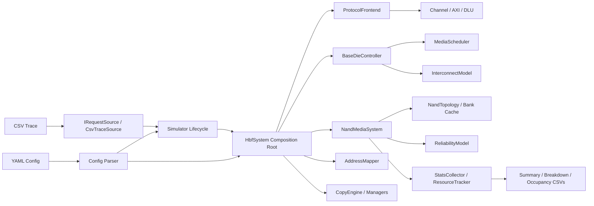
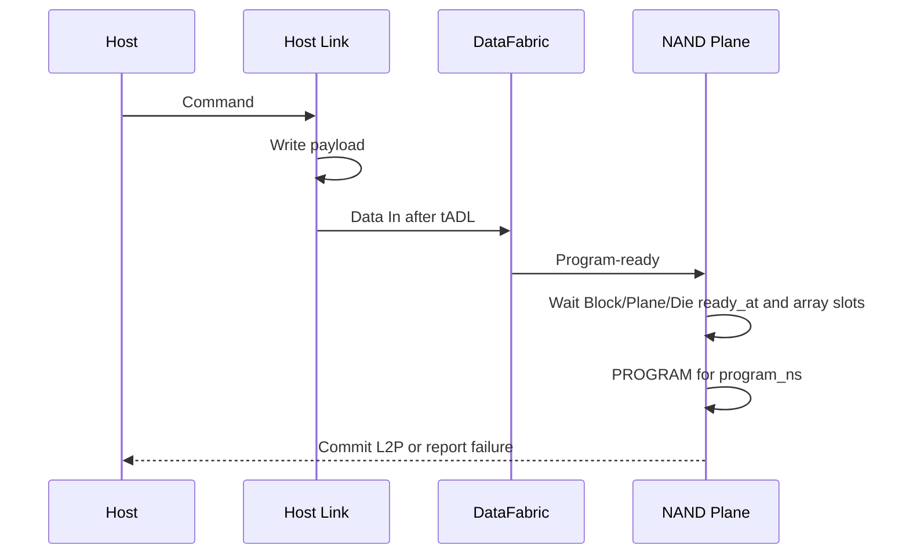
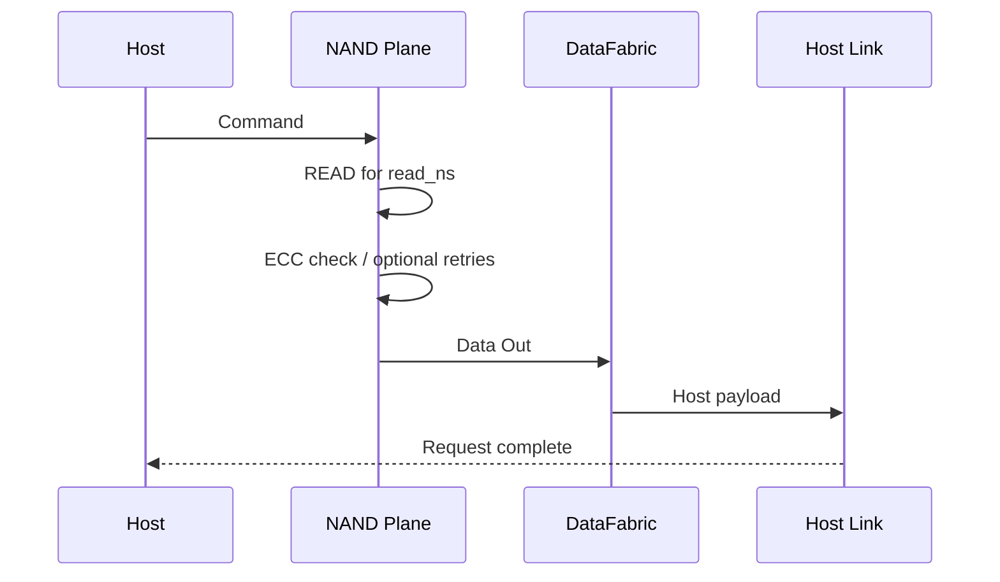

# HBFSim v0.5.1 架构设计

## 1. 目标与范围

HBFSim 用于回答以下问题：

- HBF Stack、Die、Plane 并行度如何影响延迟和吞吐；
- Host Interface 与 Base-Die Fabric 何时成为瓶颈；
- 映射、读优先调度、写饥饿保护如何改变尾延迟；
- Program/Erase、Suspend/Resume、Multi-plane、Cache Program 如何竞争资源；
- Program failure、RBER、ECC 和 Read Retry 如何影响失败率与 goodput。

它不模拟 NAND 单元电压分布、逐周期总线信号、ECC 编解码电路或 UCIe packet/flit。配置中的纳秒延迟是命令级抽象参数。

## 2. 总体结构



仿真是单线程确定性执行：所有动作最终转换为带时间戳的 `Event`，进入最小时间优先队列。相同时间戳使用递增的 `seq` 保持稳定顺序。

### 2.1 Profile 与组件所有权

`simulation.profile` 将兼容的介质研究路径、HBF v0.7 规范导向路径和 AI System
路径分开。`media_research` 保持历史行为；`hbf_v0_7` 与 `ai_system` 默认关闭
Stripe Mapping、Copy GC 和 Migration Recovery 等研究扩展。Profile 是模型选择与
结果解释边界，不等同于“已经实现全部规范”。

`HbfSystem` 是设备模型的唯一组合根，拥有 `ProtocolFrontend`、`BaseDieController`、
`NandMediaSystem`、Mapper、Reliability、CopyEngine、Host GC 与 Refresh。`Simulator`
只保留时间/事件、活动请求生命周期、仿真阶段和统计协调，不再保存指向子组件的过渡引用。
v0.4.2 进一步将 active-plane credits、dispatch cursor/wakeup 与 program-ready
队列迁入 `BaseDieController::ControllerExecutionState`；事件队列仍仅由
`Simulator` 推进。v0.4.3 将每 Plane 拆分为 `PlaneControllerState`（队列、active/
suspended/cached command）和 `PlaneMediaState`（block/page bitmap、array ready、
data register）。所有可持久化 NAND 状态转换经由 `NandMediaSystem`，而不是由
kernel 直接写入。

v0.5.0 在每个 Bank 建立独立的有序 `BankSenseQueue`。它是 Batch Read 的 Sense
资源域，不与 command-ready timestamp 或 Read Cache 混用：将来的聚合请求以一个
Batch entry 进入队列，普通 Single Read 的既有时序则保持不变。

v0.5.1 将 optional trace Batch hint 传至 `Request`/`SubRequest`。启用后，Batch
cache miss 在每 Bank 的 aggregation window 内收集，按 `max_pages` 划分 batch，
然后以 `BankSenseQueue` 的 front-only 规则开始 Sense；一个 Sense 完成才释放同
Bank 下一项。不同 Bank 不会相互阻塞。

## 3. 源码模块

| 文件 | 职责 |
|---|---|
| `src/hbf_system.cpp` | Profile 能力、`HbfResponse` 语义与设备组件组合根 |
| `src/protocol/` | Channel/AXI/DLU 语义，以及 Host 请求 admission/completion 的 `ProtocolFrontend` |
| `src/config/` | YAML 子集解析、单位/合法性校验和 resolved configuration 输出 |
| `src/frontend/` | `IRequestSource` 流式接口、CSV 逐条读取和时间戳校验 |
| `src/kernel/` | 确定性事件队列、请求生命周期、事件循环与完成状态迁移 |
| `src/controller/` | `BaseDieController`、来源感知调度和 Host/Fabric 互连资源 |
| `src/media/` | `NandTopology`、介质状态、Bank Read Cache 和可靠性模型 |
| `src/mapping/` | Mapping policy 选择以及逻辑地址到物理介质的映射 |
| `src/management/` | Retention Deadline 扫描、Refresh 任务准入和定时唤醒 |
| `src/extensions/` | Host-managed 条带、CopyEngine、Program Recovery 与 Host GC |
| `src/stats/` | 在线资源占用、固定内存分位数、队列采样和结果输出 |

公共接口按 `common/config/protocol/controller/media/mapping/management/extension/stats`
拆分；`include/hbfsim/core.h` 仅作为源代码兼容 umbrella。

## 4. 设备与资源层次

```text
Device
└── Stack [stacks]
    ├── Host Channel [host_channels_per_stack]
    ├── Base-Die DataFabric
    │   └── Data Port [ports_per_stack]
    └── Die [dies_per_stack]
        ├── Bank [banks_per_die]
        │   └── Read Cache [2 × 4KiB]
        └── Plane [planes_per_die]
            └── Block [blocks_per_plane]
                └── Page [pages_per_block]
```

Host-managed 介质在物理 Plane 展平空间之上增加等宽 Parallelism Group：

```text
Device planes
├── Parallelism Group 0 ── Physical Stripe [block 0..B-1]
├── Parallelism Group 1 ── Physical Stripe [block 0..B-1]
└── Parallelism Group N ── Physical Stripe [block 0..B-1]
```

`stripe.scope` 可选择全 Device、每 Stack 或自定义连续 Lane 数。默认全 Device，与 v0.2.6 完全兼容。

PPA 包含 `channel/stack/die/plane/block/page/offset/data_port`；独立的 `HostRoute` 包含 Channel、AXI Port 及其 Local Address。Host Channel 不再由 `data_port` 取模推导。Plane 被展平为全局索引，用于状态数组和利用率统计。

在 `hbf_v0_7`/`ai_system` Profile 中，Host Channel 已升级为一级地址和介质所有权域：

```text
Global Address
  → Channel interleave
  → Channel ID + Channel Local Address
  → AXI Port interleave
  → AXI Port + Port Local Address
  → Channel-owned contiguous Plane pool
```

Channel 与 AXI Port interleave 支持 64B–4KiB 的 2 的幂粒度；每个 Channel 只能配置
1/2/4 个 AXI Port。每 Stack 的 Plane 数必须能被其 Channel 数整除，确保 Channel 的
NAND Pool 不跨 Stack，也不会访问其他 Channel 的介质。

每个层次承担不同约束：

- Host Channel：可配置共享半双工，或拆分 Command/H2D/D2H 三个方向；
- DataFabric：Stack 内部总带宽与端口占用；
- Stack/Die：活跃 Plane 数量上限；
- Plane：队列、数据寄存器、当前阵列操作和挂起操作；
- Block：生命周期、Program frontier、有效/失效/失败位图和 ready 时间。

## 5. 请求与事件模型

Host 请求先转成 `Request`。研究路径按 Page 边界拆成 `SubRequest`；规范路径由 `HbfProtocolValidator` 校验 64B 对齐、4KiB 上限以及 Channel/AXI Port/Channel-local Page 边界，再由 DLU 或 Read 路径形成 Page 事务。`FlashTransaction` 是 `SubRequest` 的显式语义别名。Erase 和 Refresh 生成一个维护事务。

规范 Write 先以 64B 对齐 fragment 进入 `DluAssembler`。每个 Channel 独立限制 Pending
DLU 数；完整 4KiB 后才生成一个 NAND Program。首个 fragment 启动 timeout 事件，超时
返回 Write Status `0x5`。Pending DLU 上的 Read 对已覆盖范围直接转发，对未覆盖范围返回
Read Status `0xA`。写 Page 0 遇到 dirty Block 时执行 Erase+Program 组合操作。

AXI 事务按 `(Channel, Port, ID)` 维护 issue FIFO：同 ID completion 严格保序，不同 ID
可以乱序释放。这里只建模 AR/AW/W/R/B 事务级顺序、outstanding 和带宽竞争，不模拟
UCIe PHY/flit 信号。

规范 Read 在 Pending DLU 查询之后访问每 Bank 两条目的 4KiB Read Cache。命中只经过
DataFabric 与 Host D2H；未命中进入 NAND Sense，并在成功完成时填充 Cache。Program、
Erase、Retirement 和 generation 变化会使相关条目失效。Bank 同时是规范路径的命令间隔
域；研究路径继续保留原有 Die 命令域。

主要事件如下：

```text
DispatchWake
HostArrival → HostCommandDone → SubreqReady
NandDataInDone → NandProgramDone
NandReadDone → NandDataOutDone → SubreqDone
NandSuspendDone
NandEraseDone / NandRefreshDone
```

### 5.1 Write 路径



Host-managed 写入在 Host 命令拆分阶段按照 LPN 顺序预留物理 slot，使多个并发在途写仍保持确定的条带顺序；Program 成功后设置 `valid_bitmap`，失败后设置 `failed_bitmap` 并产生 Host 可见的 `ProgramFailureNotice`。覆盖写、跳写和对非 `OPEN` 条带继续写入都会被拒绝。

### 5.2 Read 路径



Read 阵列阶段结束后释放 Die/Stack active-plane slot，但 Plane 的数据寄存器保持占用，直到 Data Out 完成。Host payload 返回可继续在 Host Link 上流水化。

## 6. 调度架构

每个 Plane 先按 Read、Write、Erase、Refresh 区分操作，再按 `TransactionSource` 维护独立 FIFO。这样 Recovery/GC 可以与前台请求竞争相同物理资源，同时保留来源内顺序。

基本策略：

1. 默认优先级为 Critical Recovery、User Read、Recovery、User/Mapping、Maintenance/Refresh、GC；
2. 普通非 GC 写等待超过 `write_starvation_ns` 后获得最高仲裁级别；
3. 任意来源等待超过 `source_aging_ns` 后获得最高仲裁级别，避免后台饥饿；
4. 连续读取达到 `max_consecutive_reads` 后提升非 Read 请求；
5. 同级请求按照 enqueue time 和 transaction id 保持确定性顺序；
6. Stack 内通过 round-robin cursor 扫描 Plane，避免固定从 Plane 0 开始；
7. 操作还必须满足 Die 和 Stack 的 active-plane 上限。

低优先级 GC Read 不会仅因到达就 Suspend 正在运行的高优先级 User Program；只有优先级足够高或已经达到 aging 阈值的 Read 才能触发 Suspend。

命令最早发射时间为：

```text
max(
  subrequest.ready_time,
  plane.ready_at,
  block.ready_at,
  die.ready_at,
  die.command_ready_at
)
```

若当前时间尚未达到该值，调度器生成 `DispatchWake`，届时重新仲裁，而不是忙等。

## 7. 高级命令

### 7.1 Suspend/Resume

启用后，正在执行的 Program 或 Erase 可以为同 Plane 的排队 Read 让路：

```text
Program/Erase active
→ Suspend command
→ suspend_ns
→ release array slot
→ serve reads
→ resume_ns
→ continue remaining array time
```

旧完成事件通过 `array_completion_time` 校验自动失效。为避免没有收益的切换，剩余时间必须大于 suspend 与 resume 开销之和。Cache Data In 占用数据寄存器时不会开始 Suspend。

### 7.2 Multi-plane

同一 Die 上，操作类型、Block index 和 Page index 相同、Plane 不同的请求可以组成一个 batch。`multi_plane_setup_ns` 是收集窗口，batch 共享一次 Die command interval，但每个 Plane 仍独立占用 array slot。

### 7.3 Cache Program

每个 Plane 最多暂存一个后继 Write。后继页的 Data In 可以和当前 Program 阵列阶段重叠；当前 Program 完成后再开始缓存页的 Program。Cache admission 仍服从统一队列顺序，不能越过更早的 Erase 或 Refresh。

## 8. 确定性与内存策略

- 相同 trace、配置和 `random_seed` 应产生相同结果；
- 稳定 Page 状态使用按需分配的位图；
- `READING/PROGRAMMING` 只保存在全局稀疏瞬态表中；
- 已完成 Request/SubRequest 会从活动表删除；
- `CsvTraceSource` 仅保留下一条记录，事件队列只包含到达或在途事件；
- 延迟分位数使用固定大小对数直方图，不保存全部延迟样本；
- ResourceTracker 在事件时间线上累计 active-count area，不保存操作区间；常驻空间由 Stack/Die/Plane/Port/Channel 数量决定；
- Queue Depth 按 `queue_depth_sample_interval_ns` 限频，并总是保留最终状态；
- 该设计避免为完整设备容量创建重量级 Page 对象。

生产执行路径按 `INITIALIZE → WARMUP → MEASURE → DRAIN` 推进。Warmup 请求完成后才读取 Measurement 的第一条 trace；若原始时间戳早于 Warmup 完成时间，Measurement 整体平移，保持请求间隔不变。

## 9. Host-managed 条带映射与 Parallelism Group

系统不采用传统逐 Page Reverse Mapping，而是在上层保证逻辑地址和物理地址均按固定条带顺序写入的前提下，使用 `StripeMappingTable`、条带描述符和可逆交织公式完成 LPN/PPA 双向计算。正常路径只保存 `logical_base_lpn`、物理条带身份、`generation`、写入 frontier 和状态 bitmap；v0.3.0 的物理条带由一个 Parallelism Group 内所有 Lane 上相同 Block index 的 Block 组成。

当前已经实现：

- 对齐条带分配和 replacement 分配；
- `slot → PPA` 与 `PPA → slot/LPN` 的 O(1) 双向公式；
- `VALID/INVALID/FAILED/HOLE` lazy bitmap；
- 严格顺序 slot 预留、无覆盖写以及失败仍消耗 slot；
- `OPEN/SEALED/DEGRADED/MIGRATING/STALE/ERASING/FREE` 生命周期；
- `BEGIN_MIGRATION/REMAP_COMMIT/ABORT_MIGRATION` 的原子元数据语义；
- 整条带多 Lane Erase，以及复用时 generation 递增；
- 访问 generation 校验和 Program Failure Notice。
- `TransactionSource × OpType` 独立 FIFO、来源优先级和后台 aging；
- 通用 CopyEngine 驱动的 Recovery 与显式 Host GC；
- `HostGcManager` 驱动的 low/high watermark 自动 Host GC、OP 容量预留、`invalid_ratio`/`greedy` Victim 策略与全失效条带直接 Erase；
- `TRIM/INVALIDATE/DISCARD` Host 控制请求，用于在禁止隐式覆盖的前提下显式释放逻辑 Page；
- Read-ahead、容量受限 Host Copy Buffer、多在途 Read/Program 和严格顺序 destination slot 预留；
- destination Program Failure 后 abort、重新分配和有限次数重试；
- Copy 完成后的原子 remap 与 source 多 Lane Erase；
- Recovery/GC 分来源流量、延迟、完成状态和写放大统计。
- Retention Deadline、RefreshManager 和复用同一 CopyEngine 的 Automatic Refresh；
- erase_count 驱动的 RBER/Program/Erase Failure、Block/Stripe Retirement 和容量降级统计。
- Device/Stack/Custom Parallelism Group、组间轮转分配、组内 Erase 完成和组级退休故障域。

Program Failure 和 GC 均由 Host policy 发起数据 Copy。`auto_recovery_enabled` 表示仿真 Host 收到失败通知后自动执行既定恢复策略；GC 既可由 Host 通过 `start_host_gc(logical_addr)` 显式选择 victim，也可由 `HostGcManager` 在 free stripe 到达低水位时自动选择。目标条带完成并 Seal 之前，旧条带保持 ACTIVE；只有 `REMAP_COMMIT` 能原子切换权威映射。完整设计见 [HOST_MANAGED_STRIPE_MAPPING.md](HOST_MANAGED_STRIPE_MAPPING.md)。

## 10. 扩展接口

建议后续按以下边界扩展：

- Wear leveling：使用 `erase_count` 驱动 block 选择；
- Retention/Read disturb：在 ReliabilityModel 中根据时间和读次数动态计算 RBER；
- Thermal：根据 Stack 功耗状态动态缩放时序；
- Protocol：在 Host Link 外增加 packet/flit 与 credit 模型；
- 并行事件：保持事件语义不变，再按 Stack 分区并行化。

## 11. 当前边界

- Multi-plane 是兼容命令级合并，不模拟厂商专有命令序列；
- Cache Program 为单页缓存，不模拟任意深度流水；
- ECC 只反映纠错能力和延迟结果，不模拟编码器面积与能耗；
- Suspend/Resume 不模拟模拟电压恢复细节；
- `tCCS/tADL/tWHR` 是资源可用时间约束，不是引脚波形仿真。
- 条带级映射、Parallelism Group、Recovery、Host GC、Automatic Refresh、磨损/退休、在线统计和实验元数据已进入 v0.3.0；完整 extent/sparse Host 写入 fallback、Wear Leveling、温度/读扰模型和 cost-benefit Victim 策略仍未实现。
