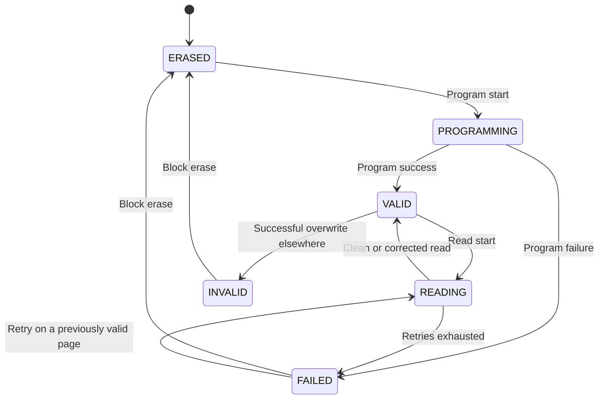

# 介质状态、时序与可靠性模型

## 1. Page 状态模型

Page 状态定义为：

```text
ERASED, READING, PROGRAMMING, VALID, INVALID, FAILED
```

状态转换：



实现上：

- `valid_bitmap` 保存 VALID；
- `invalid_bitmap` 保存 INVALID；
- `failed_bitmap` 保存 FAILED；
- 稀疏 `transient_page_states_` 保存 READING/PROGRAMMING；
- 三个位图均未命中时为 ERASED。

瞬态状态优先于稳定状态，因此读期间查询 Page 会得到 READING，Program 期间会得到 PROGRAMMING。

## 2. Block 状态模型

Block 状态为：

```text
FREE → OPEN → CLOSED → ERASING → FREE
                               ↘ BAD
```

关键字段：

| 字段 | 含义 |
|---|---|
| `next_program_page` | 下一个合法顺序编程页 |
| `valid_pages` | 有效 Page 数 |
| `invalid_pages` | 被覆盖失效的 Page 数 |
| `erase_count` | 擦除次数 |
| `last_program_time` | 最近 Program 完成时间 |
| `last_refresh_time` | 最近 Refresh 完成时间 |
| `ready_at` | Block 可接受相关命令的最早时间 |
| `bad` | 坏块标记 |

Program 必须满足：

```text
paddr.page == block.next_program_page
```

并且目标 Page 不能已经 VALID。成功和失败的 Program 尝试都会消耗当前顺序位置；只有成功 Program 才提交 L2P。

Erase 开始时进入 ERASING；完成时清空三类 Page 位图、计数和 frontier，并增加 `erase_count`。

## 3. Plane 与 Die 状态

Plane 维护：

- 四类请求队列；
- `busy` 和 `data_register_busy`；
- 当前 active、suspended 和 cached 子请求；
- `ready_at`；
- 连续读计数。

Die 维护：

- `ready_at`：数据或阵列操作后的恢复屏障；
- `command_ready_at`：下一条独立命令允许发射的时间。

此外，`active_per_die` 和 `active_per_stack` 限制正在占用 NAND array 的 Plane 数量。

## 4. 基础 NAND 时序

| 配置 | 模型含义 |
|---|---|
| `read_ns` | 一次阵列读取时间 |
| `program_ns` | 一次阵列编程时间 |
| `erase_ns` | 一次 Block 擦除时间 |
| `t_ccs_ns` | 同 Die 独立命令之间的最小间隔 |
| `t_adl_ns` | Write 命令到 Data In 可开始的延迟 |
| `t_whr_ns` | Data/Array 完成后的 Die/Block/Plane 恢复时间 |
| `suspend_ns` | 挂起命令开销 |
| `resume_ns` | 恢复命令开销 |
| `multi_plane_setup_ns` | 收集兼容 Multi-plane 请求的窗口 |
| `cache_program_setup_ns` | Cache Data In 的额外准备时间 |
| `read_retry_ns` | 两次读取尝试之间的额外时间 |

### 4.1 Write 延迟

单页 Write 的简化关键路径：

```text
Host command
+ Host payload serialization
+ Host fixed latency
+ tADL
+ Fabric serialization/port waiting
+ Fabric fixed latency
+ ready_at waiting
+ program_ns
```

Cache Program 可将下一页的 `tADL + Fabric Data In` 与当前 `program_ns` 重叠。

### 4.2 Read 延迟

```text
Host command
+ ready_at waiting
+ read_ns
+ Σ(read_retry_ns + read_ns)
+ Fabric Data Out
+ Host payload return
```

读取完成时的 ECC 结果决定是否进入 Retry。重试期间 Plane 和阵列并行度配额保持占用。

### 4.3 Erase 与 Refresh

```text
Erase latency   = ready waiting + erase_ns
Refresh latency = ready waiting + read_ns + program_ns
```

Program/Erase 恢复后，后续命令还需要满足 `t_whr_ns`。

## 5. Host Link 与 DataFabric

Host Link 使用流水线带宽模型：

```text
start = max(now, link.free_at)
serialization = ceil(bytes / bytes_per_ns)
link.free_at = start + serialization
completion = link.free_at + fixed_latency
```

固定传播延迟不会阻塞下一次序列化，因此不会被错误地按 Page 完全串行叠加。

DataFabric 同时受以下条件约束：

- Stack aggregate bandwidth；
- 目标 data port 的可用时间；
- 固定传播延迟。

不同端口可以在端口服务阶段重叠，但整体长期吞吐不能超过 aggregate bandwidth。

## 6. Program failure

每次 Program 完成时，以 `program_failure_rate` 做 Bernoulli 抽样。

成功：

- 新 Page 进入 VALID；
- 覆盖写的旧 Page 进入 INVALID；
- Host-managed L2P 指向新 PPA。

失败：

- 新 Page 进入 FAILED；
- 请求标记失败；
- 顺序编程位置仍前进；
- 旧 L2P 和旧有效 Page 保持不变。

## 7. RBER、ECC 与 Read Retry

第 `retry` 次读取的期望位错误数为：

```text
lambda = bytes × 8 × raw_bit_error_rate
         × retry_ber_multiplier ^ retry
```

错误数从 `Poisson(lambda)` 抽样，并限制为不超过读取位数。

判断规则：

```text
errors == 0                         → CLEAN
0 < errors <= ecc_correctable_bits → CORRECTED
errors > ecc_correctable_bits      → UNCORRECTABLE
```

UNCORRECTABLE 且未达到 `max_read_retries` 时，等待 `read_retry_ns` 后重新执行 `read_ns`。重试耗尽后请求失败，Page 进入 FAILED。后续读取若成功，可以清除读取产生的 FAILED 标记。

随机序列由 `random_seed` 固定，便于实验复现。

## 8. 关键不变量

代码和测试应持续保证：

1. 同一 Plane 不同时执行两个 array operation；
2. Active Plane 数不超过 Die/Stack 上限；
3. Program 不跳过 `next_program_page`；
4. L2P 只在 Program 成功后提交；
5. Erase 清理该 Block 的 L2P 和 Page 状态；
6. Cache Program 不越过更老的 Erase/Refresh；
7. 挂起前的旧完成事件不能重复完成请求；
8. 相同时间事件按 `seq` 确定性执行；
9. Warm-up 请求影响设备状态，但不进入测量统计。

## 9. 模型边界

当前可靠性是统计抽象，没有建模：

- Cell-to-cell interference；
- Retention 随时间变化；
- Read disturb 累积；
- 不同阈值电压分布和软判决等级；
- ECC 编解码吞吐、面积与功耗；
- Factory bad block 与运行时坏块增长策略。

这些机制可在现有 ReliabilityModel 和 BlockMeta 之上扩展，无需改变事件循环接口。
